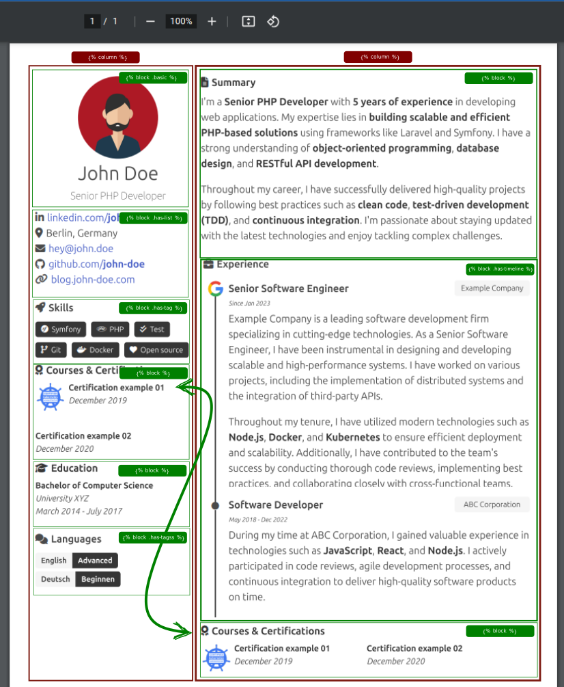

<p align="center">
  
</p>

> **Warning**
>
> **Note 1:** In case you want to run the code locally with yaml structure you must use version [3.0.0-yaml](https://github.com/shield-wall/myprofile/releases/tag/3.0.0-yaml).
>
> **Note 2:** the current version is using markdown, then look at this [resume](https://github.com/shield-wall/myprofile/discussions/723) until the doc be update.

# Generate your resume

Just create a new [Resume discussion](https://github.com/shield-wall/myprofile/discussions/new?category=resume) :smiley:.

# Documentation

Check the full documentation clicking [here](https://myprofile.pro)

# Example

It's an example how your resume will be generated, to understand better how to move things in your resume check [here](https://myprofile.pro/structure/overview/)



Check here [here](https://bucket.myprofile.pro/users/eerison/resume.html) a real example.

# How to run the project locally
I'm assuming that you have node 18 or higher installed in your machine.
```
npm install
npm run node:group:init
npm run dev
npm run node:group:pdf
```

## Preview​
you can edit resume data in data/data.yaml

Note: you need to generate json and pdf again
```
npm run node:group:pdf
```
